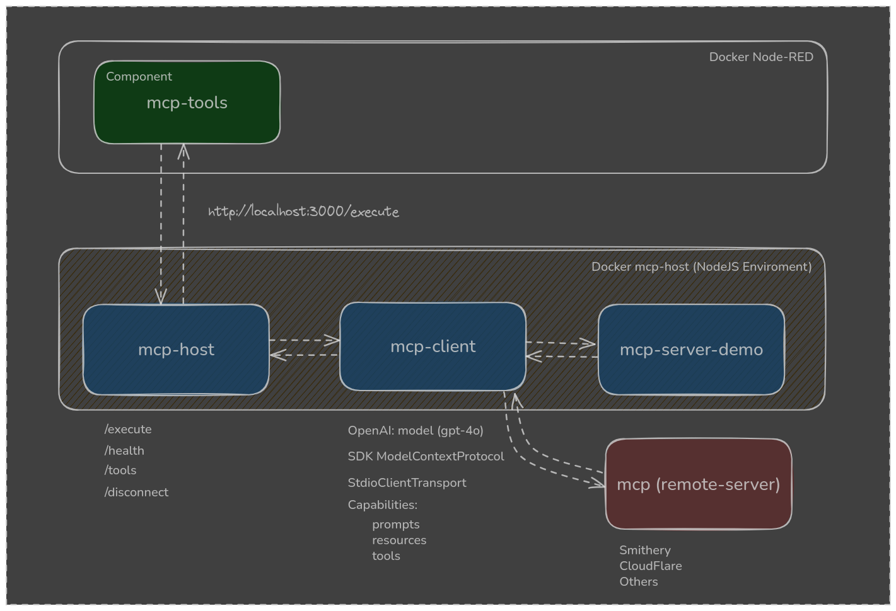

# Node-RED MCP Server 
<div align="center">


[](https://badge.fury.io/js/node-red-contrib-mcp-tools)
[](https://snyk.io/test/npm/node-red-contrib-mcp-tools/1.0.2)
</div>

Connects Node-RED to LLMs via the Model Context Protocol (MCP) for intelligent AI workflows.

[](https://railway.com/deploy/node-red-mcp)

> **🚀 Ready-to-deploy Railway template** - Node-RED configured with MCP (Model Context Protocol) for LLM integration

## 📋 Project Description

This project contains a Docker structure with two main containers that integrate Node-RED and mcp-host to run the MCP Server (Model Context Protocol). The goal is to allow Node-RED flows to interact with LLM models like OpenAI's GPT-4 using an MCP server.

This first version supports only the GPT-4 model from OpenAI.

You can run both local and remote MCP servers.
Example of a remote MCP:

```bash
npx -y @smithery/cli@latest run @nickclyde/duckduckgo-mcp-server --key your-smithery-key
```

[🔗 Find other MCPs on smithery.ai](https://smithery.ai)

## 🚀 Ready-to-Deploy Templates

### Node-RED MCP Template for Railway

To facilitate deployment and get started quickly, we've created an optimized template for Railway:

**[📋 View Complete Template](node-red-docker/README.md)**

**Template Features:**
- ✅ **One-click deploy** on Railway
- ✅ **Node-RED 4.0.0** pre-configured
- ✅ **MCP Tools Node** already installed
- ✅ **Automatic configuration** via environment variables
- ✅ **Automatic admin password generation**

**How to use:**
1. Access the [Template README](node-red-docker/README.md)
2. Click the "Deploy on Railway" button
3. Configure your environment variables
4. Get the admin password from Railway logs
5. Ready! Node-RED running in the cloud

**🔐 Getting Admin Password on Railway:**
After deployment, the admin password is generated automatically. To find it:
1. Access Railway Dashboard
2. Click on your project
3. Go to "Deployments" tab
4. Click on the latest deployment
5. Go to "Logs" tab
6. Look for the "NODE-RED ADMIN CREDENTIALS" block

---

## ▶️ How to Run

Steps to run the project via docker compose:

1. Clone this repository:
   ```bash
   git clone https://github.com/moises-paschoalick/node-red-mcp-server
   cd node-red-mcp-server
   docker compose up -d
   ```

2. Open the project at: http://localhost:1899/


3. Install the mcp-tools node
   To do this, we need to have the mcp-tools node, install node-red-contrib-mcp-tools in the Node-RED UI.

   Options -> Manage Palette
   Install node-red-contrib-mcp-tools
   [Installation Image]

   [link to node-red-contrib-mcp-tools]
   npm project link

4. Configure the component with your OpenAI API key
   [Component Image]

## 🔐 Environment Variables & Security

### OpenAI API Key Configuration

The `mcp-tools` component supports multiple ways to configure your OpenAI API key:

#### Option 1: Direct Input (Not Recommended for Production)
- Enter your API key directly in the component configuration
- The field will be masked as a password for security
- **⚠️ Warning**: This method exposes your API key in the Node-RED flows

#### Option 2: Environment Variable (Recommended)
- Use the format: `{{OPENAI_API_KEY}}`
- The component will automatically detect and use the system environment variable
- **✅ Secure**: API key is not stored in flows

#### Option 3: Node-RED Credentials
- Store your API key in Node-RED's credential management system
- Most secure option for production environments

### MCP Server Environment Variables

The component can pass environment variables to your MCP servers in several ways:

#### Option 1: JSON Configuration
```json
{
  "id_field": "your_spreedsheed_id",
  "GOOGLE_CLIENT_ID": "your-google-client-id",
  "GOOGLE_CLIENT_SECRET": "your-google-client-secret",
  "GOOGLE_REFRESH_TOKEN": "your-google-refresh-token"
}
```

#### Option 2: Environment Variable Reference
- Use the format: `{{ENV_MCP_VARIABLES}}`
- The component will load from system environment variables
- **✅ Secure**: Credentials are not stored in flows

#### Option 3: External File
- Specify a `.env` file path in the component
- The component will read and parse the file automatically

### Dynamic Variable Substitution in Prompts

The component automatically substitutes environment variables in your prompts using the `{{VAR_NAME}}` format:

#### Example Usage:
**Original Prompt:**
```
update field {{id_field}} range Sheet1!A1 value Updated Line 2
```

**After Substitution:**
```
update field 1t6w************************************yWGU range Sheet1!A1 value Updated Line 2
```

#### Supported Variable Sources:
1. **MCP Server Environment Variables** (highest priority)
2. **System Environment Variables** (fallback)
3. **Component Configuration** (lowest priority)

### Security Best Practices

1. **Never commit real credentials** to version control
2. **Use environment variables** for production deployments
3. **Store sensitive data** in `.env` files (not committed)
4. **Use Node-RED credentials** for API keys when possible
5. **Regularly rotate** your API keys and tokens

### Example Environment Configuration

Create a `.env` file in your project root:

```bash
# OpenAI API Key
OPENAI_API_KEY=sk-your-actual-api-key-here

# MCP Server Environment Variables (JSON string)
ENV_MCP_VARIABLES={"id_field":"your-spreadsheet-id","GOOGLE_CLIENT_ID":"your-google-client-id","GOOGLE_CLIENT_SECRET":"your-google-client-secret","GOOGLE_REFRESH_TOKEN":"your-google-refresh-token"}

# Alternative: Individual variables
# id_field=your-spreadsheet-id
# GOOGLE_CLIENT_ID=your-google-client-id
# GOOGLE_CLIENT_SECRET=your-google-client-secret
# GOOGLE_REFRESH_TOKEN=your-google-refresh-token
```

**⚠️ Important**: Add `.env` to your `.gitignore` file to prevent accidental commits.

### Practical Example: Google Sheets Integration

Here's a complete example of how to use environment variables with the `mcp-tools` component for Google Sheets operations:

#### 1. Environment Configuration
```bash
# .env file
OPENAI_API_KEY=sk-your-openai-key
ENV_MCP_VARIABLES={"id_field":"your_spreedsheed_id","GOOGLE_CLIENT_ID":"your-client-id","GOOGLE_CLIENT_SECRET":"your-client-secret","GOOGLE_REFRESH_TOKEN":"your-refresh-token"}
```

#### 2. Component Configuration
- **MCP Host URL:** `http://mcp-host:3000`
- **OpenAI API Key:** `{{OPENAI_API_KEY}}`
- **MCP Server Command:** `node`
- **MCP Server Args:** `../mcp-server-demo/gdrive-mcp/build/index.js`
- **MCP Server Environments:** `{{ENV_MCP_VARIABLES}}`

#### 3. Message Payload
```json
{
  "payload": "update field {{id_field}} range Sheet1!A1 value Updated Line 2"
}
```

#### 4. Result
The component will automatically:
1. Load environment variables from `{{ENV_MCP_VARIABLES}}`
2. Substitute `{{id_field}}` with the actual spreadsheet ID
3. Send the processed prompt to the MCP server
4. Execute the Google Sheets operation

## 🧱 Container Structure

- **`mcp-host`**  
  Component built in Node.js that acts as a bridge between Node-RED (via `mcp-tools` component) and MCP Servers.  
  It is responsible for mediating communication between the `mcp-client` (LLM model) and the `mcp-server` (understands tool implementations).

- **`mcp-server-demo`** (Node-RED)  
  Contains the Node-RED environment already configured to communicate with `mcp-host` using the `mcp-tools` component. It's an example of an MCP server built in NodeJS to test and verify if the environment is functional.

> **Important**: in the **mcp-tools** component within Node-RED, you need to configure the MCP Host URL as:
> ```
> http://mcp-host:3000
> ```

---

## 📦 Components

- **`mcp-host`**
  - Receives calls from Node-RED via `mcp-tools`
  - Redirects the request to `mcp-client`
  - Forwards the result to `mcp-server` (local or remote)
  
- **`mcp-client`**
  - Handles communication with a language model (LLM)
  - Currently uses OpenAI's `gpt-4o` model
  - Can be modified to use other models in the future (e.g., Claude, Gemini, LLaMA)

- **`mcp-server-demo`**
  - A functional example of an MCP Server running locally
  - Contains "tools" that can be called by the model, such as:
    - **Hello Tool**: responds with "Hello World"
    - **Local Time**: returns the local server time
    - **Weather Tool**: queries current weather in São Paulo via `wttr.in`

---

### Prerequisites

- Docker
- Docker Compose

### Endpoints to verify mcp-host integrity
http://localhost:3000/health

## Architecture

<p align="center">
  
</p>

### Components

#### 1. **mcp-host** (Web Server)
- **Location:** `/mcp-host/`
- **Function:** Express.js server that orchestrates communications
- **Port:** 3000 (configurable)
- **Endpoints:**
  - `POST /execute` - Executes prompts
  - `GET /health` - Server status
  - `GET /tools` - Lists available tools
  - `POST /disconnect` - Disconnects sessions

#### 2. **mcp-client** (MCP Client)
- **Location:** `/mcp-client/`
- **Function:** Class that manages connections with MCP servers and OpenAI
- **Features:**
  - Automatic connection/disconnection
  - Session management
  - MCP tools conversion to OpenAI format
  - Prompt execution with tool calling

#### 3. **mcp-server** (MCP Server)
- **Location:** `/mcp-server/`
- **Function:** MCP server implementation with tools and resources
- **Included tools:**
  - Hello Tool (example)
  - Users Tool (external API)
  - Textract Tool (image analysis)

#### 4. **node-red-mcp-component** (Node-RED Component)
- **Location:** `/node-red-mcp-component/`
- **Function:** Customizable Node-RED node
- **Configurations:**
  - MCP Host URL
  - OpenAI API Key (supports `{{ENV_VAR}}` format)
  - MCP server command
  - MCP server arguments
  - MCP server environment variables (supports `{{ENV_VAR}}` format)
  - External environment file path
  - Session ID
  - Timeout
- **Features:**
  - **Dynamic environment variable substitution** in prompts
  - **Smart input field types** (password for keys, text for env vars)
  - **Multiple credential sources** (direct, env vars, credentials)
  - **Automatic JSON parsing** for environment variables
  - **Session management** for connection reuse

## API Endpoints

### POST /execute

Executes a prompt through the MCP agent.

**Request Body:**
```json
{
  "prompt": "show hello world message",
  "apiKey": "sk-your-key-here",
  "serverCommand": "node",
  "serverArgs": ["../mcp-server/build/index.js"],
  "sessionId": "default"
}
```

**Response:**
```json
{
  "success": true,
  "response": "Hello, World! This is a tool response!",
  "toolsUsed": [...],
  "messages": [...]
}
```

### GET /health

Checks server status.

**Response:**
```json
{
  "status": "ok",
  "timestamp": "2025-06-11T23:32:04.612Z",
  "activeClients": 0
}
```

### GET /tools

Lists available tools.

**Query Parameters:**
- `apiKey` - OpenAI API Key
- `serverCommand` - MCP server command
- `serverArgs` - MCP server arguments

## Installation and Configuration (without Docker)

### 1. Prepare Components

```bash
# Install mcp-server dependencies
cd mcp-server
npm install
npm run build

# Install mcp-client dependencies
cd ../mcp-client
npm install
npm run build

# Install mcp-host dependencies
cd ../mcp-host
npm install
```

### 2. Start MCP Host

```bash
cd mcp-host
npm start
```


The server will run on port 3000.

## 🤝 Contributing

1. **Fork** the project
2. **Create a branch** for your feature (`git checkout -b feature/AmazingFeature`)
3. **Commit** your changes (`git commit -m 'Add some AmazingFeature'`)
4. **Push** to the branch (`git push origin feature/AmazingFeature`)
5. **Open a Pull Request**

## 📄 License

This project is licensed under the MIT License - see the [LICENSE](LICENSE) file for details.

## 🆘 Support

### Help Channels


- **🐛 Issues**: [GitHub Issues](https://github.com/moises-paschoalick/node-red-mcp-server/issues)
- **💬 Discussions**: [Github Discussions](https://github.com/moises-paschoalick/node-red-mcp-server/discussions)

### Useful Resources

- [Node-RED Documentation](https://nodered.org/docs/)
- [Model Context Protocol](https://modelcontextprotocol.io/)
- [Railway Documentation](https://docs.railway.app/)
- [OpenAI API Documentation](https://platform.openai.com/docs/)

## 🙏 Acknowledgments

- [Node-RED](https://nodered.org/) - Visual programming platform
- [Railway](https://railway.app/) - Deployment platform
- [OpenAI](https://openai.com/) - Language models
- [MCP Community](https://modelcontextprotocol.io/) - MCP Protocol

---

**⭐ If this template was helpful, consider giving a star to the repository!**